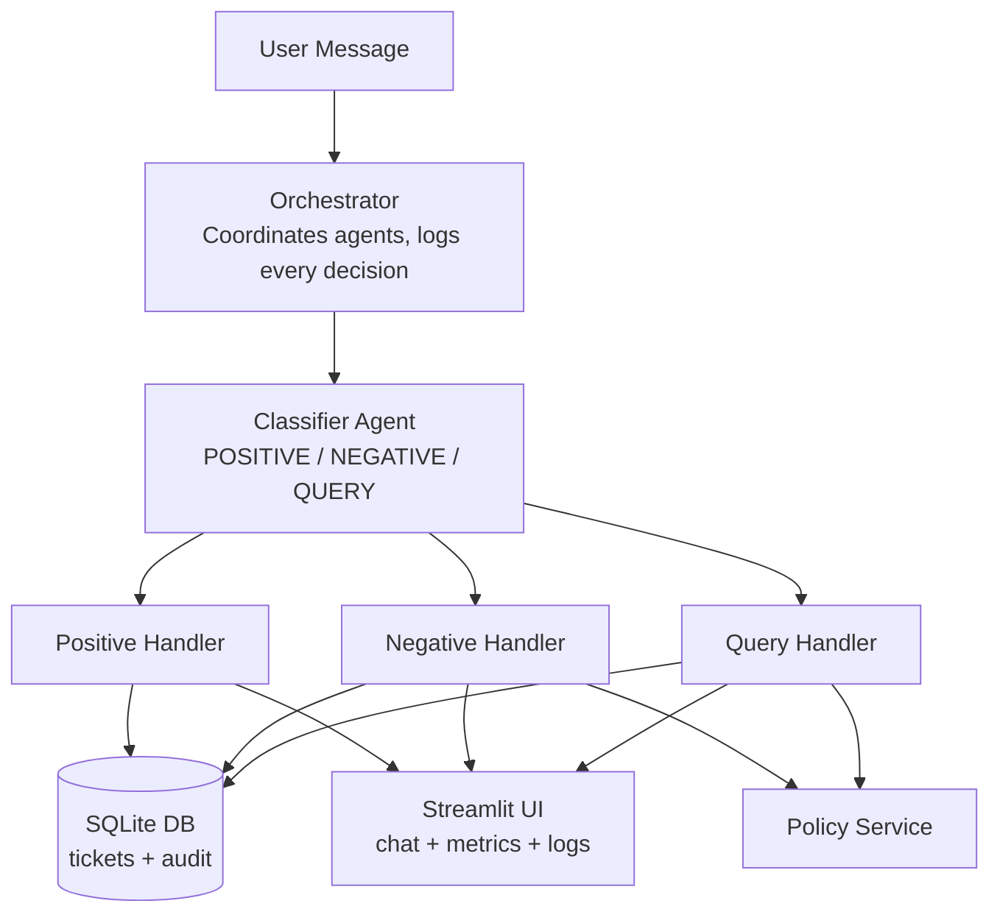
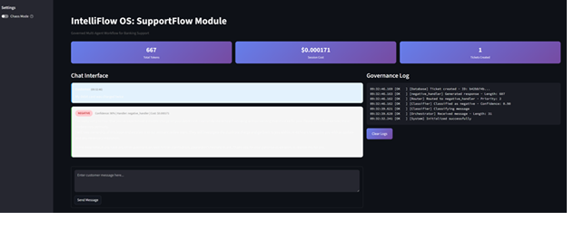
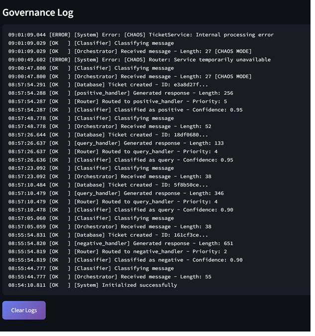
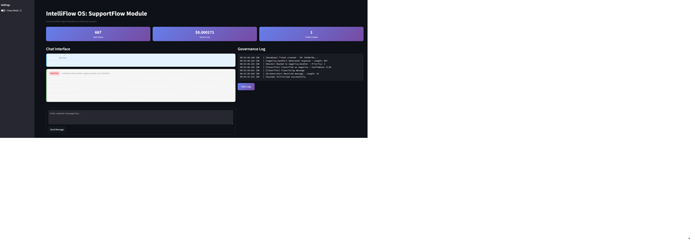

# IntelliFlow OS: SupportFlow Module
## Governed Multi-Agent Workflow for Banking Support

> "A banking AI that tracks its own costs, catches its own errors, and passes a regression suite before deployment."

---

### Overview

SupportFlow is a governed multi-agent workflow system designed for banking customer support in regulated industries. It automatically classifies incoming customer messages, routes them to specialized AI handlers, and generates policy-grounded responses—all while maintaining comprehensive audit trails, cost tracking, and governance logs.

This isn't a chatbot. It's an **auditable, testable, failure-aware** workflow engine built with enterprise patterns: policy-grounded citations, deterministic chaos engineering, and CI-gated regression testing.

**Key Capabilities:**
- **Multi-Agent Routing** — Intelligent classification with specialized handlers
- **Policy-Grounded Responses** — Every response cites documented policy (kills the "it's just if-else routing" critique)
- **Audit Logging** — Complete decision trail for regulatory compliance
- **Cost Tracking** — Per-interaction token usage and cost attribution
- **Chaos Engineering** — Deterministic failure injection with controlled blast radius
- **CI/CD Pipeline** — Regression suite runs on every code change

---

### Architecture


**The Orchestrator Pattern:** A central coordinator that receives requests, delegates to specialized agents, logs every decision, and aggregates results. This is how enterprise AI systems are built—not monolithic "do everything" models.

---

### Product Decisions (PM Perspective)

#### Why Multi-Agent vs Single Agent?
Banking support has distinct task types—complaints need tickets, praise needs acknowledgment, queries need lookups. A single agent tries to do everything and fails at edge cases. Specialized agents have:
- Clear responsibilities (easier to debug)
- Independent testing (easier to validate)
- Targeted improvements (change one without breaking others)

#### Why Policy-Grounded Responses?
In regulated industries, AI can't hallucinate. Every response cites the specific policy it's based on:
- Compliance teams can verify outputs
- Audit trails show reasoning
- Reduces legal/regulatory risk

This transforms "AI said X" into "AI said X because of POLICY-002."

#### Why SQLite for Demo?
Zero infrastructure overhead for a portfolio demo. The CRUD interface is abstracted behind repositories—swapping to PostgreSQL is a configuration change, not an architectural rewrite. Production would use managed PostgreSQL with connection pooling.

#### Why Deterministic Chaos Mode?
Chaos engineering best practice: controlled experiments with safe rollback and limited blast radius. Random failures make demos flaky. Deterministic toggles let me:
- Demonstrate resilience on command
- Test specific failure paths
- Verify graceful degradation

In production, you'd randomize with percentage-based injection.

#### Why Test Structured Outputs?
LLM responses vary in wording. Brittle tests check prose ("did it say sorry?"). Robust tests check structure:
- Did classifier return NEGATIVE label? ✓
- Did handler create a ticket row? ✓
- Did chaos mode log an error? ✓

Assert on enums and database state, not string matching.

---

### Features

#### 1. Multi-Agent Classification & Routing
| Component | Function |
|-----------|----------|
| Classifier Agent | LLM-powered categorization with confidence scores |
| Positive Handler | Generates contextual thank-you responses |
| Negative Handler | Creates ticket, stores in DB, generates empathetic response |
| Query Handler | Retrieves ticket status from database |

#### 2. Policy-Grounded Responses
- **20 banking policies** covering cards, accounts, transfers, security
- **Keyword-based retrieval** with policy ID citations
- **UI display** shows "Policy Referenced: POLICY-XXX" for transparency
- **Governance log** records which policies were cited

#### 3. Audit Logging (Full Observability)
Every decision logged with timestamp:
```
[Orchestrator] Received message - Length: 42
[Classifier] Classified as negative - Confidence: 0.90
[Router] Routed to negative_handler - Priority: 2
[PolicyService] Cited 1 policies - POLICY-002
[Database] Ticket created - ID: 92aad403...
[negative_handler] Generated response - Length: 982
```

If a regulator asks "why did the system say X?", you can show the exact decision chain.

#### 4. Cost & Token Tracking
- Real-time token counting from Azure OpenAI API response
- Cost calculation: (input × $0.00015/1K) + (output × $0.0006/1K)
- Session totals displayed in UI metrics bar
- Enables capacity planning and budget forecasting

#### 5. Chaos Engineering
Deterministic failure injection for resilience testing:
| Failure Type | Simulation |
|--------------|------------|
| Database Error | TicketService unavailable |
| Router Failure | Service temporarily unavailable |
| Timeout | Internal processing error |

System catches errors, returns user-friendly message, logs failure for debugging.

#### 6. Regression Test Suite (13 Tests)
| Category | Tests | Purpose |
|----------|-------|---------|
| Classifier - POSITIVE | 2 | Thank you messages classified correctly |
| Classifier - NEGATIVE | 2 | Complaints classified correctly |
| Classifier - QUERY | 2 | Status questions classified correctly |
| Database - Ticket Creation | 2 | Negative feedback creates DB row |
| Query Handler - DB Retrieval | 2 | Ticket lookup returns correct status |
| Chaos Mode | 3 | Failures trigger and log correctly |

Rerun after any prompt or model change to catch regressions.

#### 7. CI/CD Pipeline (GitHub Actions)
```yaml
on:
  push:
    branches: [main]
  pull_request:
    branches: [main]
```
- Tests run automatically on every push
- Results uploaded as artifacts
- Blocks merge on test failure

---

## Screenshots

### Main Dashboard

*Dashboard showing classification, cost tracking, and governance log*

### Policy Citations

*Responses cite specific banking policies*

### Governance Log

*Complete audit trail of every decision*

### Chaos Mode

*Failure injection with graceful degradation*

### Test Results

*13/13 regression tests passing*

---

### Quick Start

```bash
# Clone and setup
git clone <repo-url>
cd intelliflow_supportflow

# Install dependencies
pip install -r requirements.txt

# Configure environment
cp .env.example .env
# Edit .env with your Azure OpenAI API key

# Run tests
python test_suite.py

# Launch UI
streamlit run app.py
```

---

### Project Structure
```
intelliflow_supportflow/
├── app.py                 # Streamlit UI
├── test_suite.py          # 13-test regression suite
├── requirements.txt
├── data/
│   └── policy_kb.md       # 20 banking policies
├── src/
│   ├── agents/
│   │   ├── orchestrator.py    # Central coordinator
│   │   ├── classifier_agent.py
│   │   ├── positive_handler.py
│   │   ├── negative_handler.py
│   │   └── query_handler.py
│   ├── services/
│   │   ├── ticket_service.py
│   │   ├── audit_service.py
│   │   └── policy_service.py  # Policy retrieval
│   ├── db/
│   │   ├── connection.py
│   │   ├── models.py
│   │   └── repositories/
│   └── llm/
│       ├── client.py
│       └── token_tracker.py
└── .github/
    └── workflows/
        └── test.yml       # CI pipeline
```

---

### Tech Stack
| Layer | Technology |
|-------|------------|
| LLM | Azure OpenAI GPT-4o-mini (swappable) |
| Database | SQLite (abstracts to PostgreSQL) |
| UI | Streamlit |
| Testing | pytest + pytest-asyncio |
| CI/CD | GitHub Actions |

---

---

### Disclaimer

This is a **portfolio reference implementation** demonstrating PHI-aware architectural patterns with synthetic data.

- **Not a certified medical device**
- **Not a production HIPAA-compliant system**
- **Demonstrates compliance-informed design patterns for regulated industries**

---

### License

This project is licensed under the Apache License 2.0 — see [LICENSE](LICENSE) for details.
